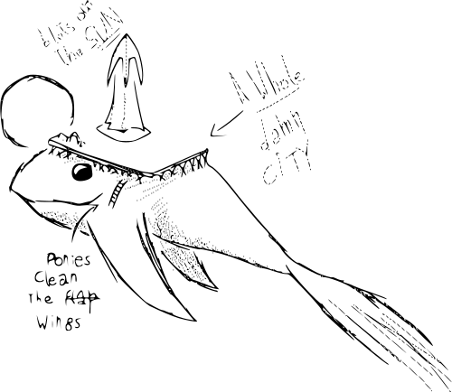
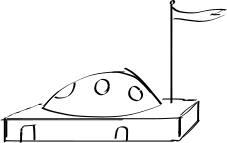
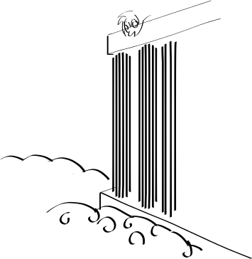

## 01 - 5

Ahoy! Onwards and updwards!

Yes!

What does a new journal mean, my dear Silver?

New adventures!

And what do you think, my dear Whisp?

She's been wrong before, I dunno...  

Adventures to find <i>Equestria</i>!  

Now that sounds more like it.

Your turn, Cyp.

To find neat stuff? 

You mean for me to keep you from falling down a hole? 

Same thing.

## 03 - 2 

Eureka! All the lock needed was some heating.
It's surprising that this place still holds in a piece after so long. The bronze-and-glass hallways are nothing less than beautiful, if crearly damaged by age, and this place might very well still be inhabited... Some rooms seem to have water damage without any leaks, verdigris patches on the ground, and others have signs of welding. A room, had a pool filled with blackwater-- A sure sign of Dudas as was the fact that there wasn't anything to alleviate the smell or keep it from spreading. Cypress already blocked that door with some paste, which Sliver called it a waste of flour, but now that room doesn't make all surrounding areas unbearable.

## 03 - 3

Another day without the team finding anyone. Sliver is as impatient as ever, buggering Whisper to go explore with her. 

This place is nonetheless fascinating. The hallways of the entire place seem to be designed as a sort of museum that has guided three lost people to the orrery so far-- more of the odd, *subliminal* -to use Cyp's word- design that pervaded the churches too. Our efforts to map it are greatly helped by the geometric logic of this place which past Duda ruins have accustomed us to.

I still wonder if it's right to call these "ruins", with the state they are in. Give me a broken window, people! Then I won't have to worry about the exact meaning of the word.

Ha. Duda glass staying broken.

-------------

Sliver insisted I include her drawing in here, which I would've done anyhow; kid's great at anything geometric. Not so much at fish, though

The hallways of the outer circle are probably the most beautiful part of this place: Light reaches us with just enough strength for it to play with the engravings on the wall, of which there are too many to count. Most of them, however, feature the same few designs. Gnash has counted four repeated ones so far.

------------

We just returned from what we decided was, to Sliver's chagrin, our first and last walk around the ruins today. The lower and upper floors are still off limits for now (Got to be methodical) and we haven't even explored half of the expected size of this place, but there's no such thing as too much precaution when exploring ruins. Not like they'll walk away. I added a folded copy of the map so far. 

## 03 - 7

The orrery is operational! I was so convinced something had to be broken it took Cypress playing a prank for me to see that it wasn't. Bless that girl! Bless her disobedience!

I hope she never reads that.

It seems to be operated in a classical Duda configuration; the sole deviation from their usual habits is that he left lever has total freedom of horizontal movement, something that seems to that one's position on the imaginary globe can be adjusted intuitively. 

And, thankfully, I found the connection I was hoping for. There *is* an alignment between these stars and Equestria's, a time of the year when our skies are the same. Over -30.0 006 x45, at least.

Now I only need to actually find a <s>star cast</s> starcaster, if they even exist.

## 03 - 10

We've decided to return to civilization for a while to restock and avoid getting cabin fever again. Sindula's ship will take off in the morn, and Whisper and me will follow as soon as we are done copying some of the engravings with carbon paper.

------

## 03 - 15

I found the tall mare Whisper heard about. She really is beautiful: Wings that wouldn't be out of place in Equestria, supple flanks, a flamboyant personality and a nice shade of pink on her mane. I don't think this mare laughs at jokes as much as she laughs at the merry and nonsense of life itself, using jokes a welcome a welcome excuse for it. And, and this is the most curious part, she reminds me of Celestia.

As Whisper was told she has respectable knowledge of legends. I will try to convince her to let me transcribe the legend of the mare in the moon.

She seemed offended that I'd do such a thing, strangely enough: "Paper cannot convey the weight of words or nuance of tone", she said with uncharacteristic seriousness, and some members of her group laughed, I don't know if to me or to her or to life itself.

Still I will copy it as best I can:

### THE STORY THAT WASN'T, OF THE MARE IN THE MOON

A long time ago Quesque, a bad Cir[*This seems to mean either a <s>grif</s> gryphon mage or leader, or just a very respected gryphon.*], grew bitter on his lighthouse.

Yet the cold breeze of the night warmed his heart, and he talked with the twinkles of the moonstars. Six twinkles were his friends: Leo, Eridanus, Cassiopeia, Lyra, Corvus and Draco. They talked about strange magics and the beauties of their own worlds.

And sometimes the twinkles talked about their sibling as well, The Old Brother. They told him of how he asked them to guide the lost to their destination. The Old Brother, they said, could have either of sexes regardless of his name, or even both, were he to ever descend to the waters below. When Quesque asked why didn't he, the twinkles were silent for many nights before answering.

"It's hard for him. The old brother is more idea than flesh, more fancy than bone. He's the hopes of finding home, for he has known the pain of being lost."

They told him much more, and the more he heard, the more Quesque loved the Big Brother. And after a long time, Quesque said:

 "I live in a lighthouse: Every day, many reach home because of me. Can't I have the honor? Am I not your friend?"

The twinkles agreed to this, and started working on complex magics together with Quesque to guide the Big Brother to the waters. Down there, they said, he'd have sight and tact and and speech and hearing, and because of this he was more impatient than anyone else to be below.

When the moment came, the six twinkles fell before the brother: Each strike to the water produced a great grand splash from which a gift was given.

Cassiopeia birthed the queen-of-tides, so that she would stop the tyranny of the sirens.

The splash of Lyra's drops taught many songs which are still sang, so that our hearts may be lit with merry.

Eridanus made an entire city of clay and glass, it's great spires striking the sky and it's ports open for all to enter.

Corvis drops fell each on a lost sailor, giving them humble cups containing food and the way home.

Leo, fiercest of them all and said to be daughter of the Brother, gave a candle with which to light your way and burn your enemies.

And, last of them all, Draco had a hard time thinking of a gift as great as all others! In her frustration she hit the water again, and again, until from her hits a giant column of water rose to the sky and covered it. It's still there on the sky, protecting us from falling stars so that we may sleep safe.

Last of all fell the Old Brother, now a sister. Her wings spread wide, her horn stood slender and tall, her body supple and her legs strong. She fell on Eridanus' city, crying Corvis' drops, singing Lyra's most perfect song, and her eyes shinning with light and beauty to rival Leo's flame. 

She stood still and crying for a long time, ignoring Quesque's words, He offered food which she did not want, a bed which she did not use, and word which she didn't answer. She stood there for a long time, thinking.

When she spoke, her voice was heard across the world:

"You gave me sight: Because of it, I can see ugliness.

You gave me a voice: Because of it, I can cry.

You gave me hearing: Because of it, I can hear wails.

You gave me tact: Because of it, I can feel pain."

To which Quesque said:

 "We gave you a world in which to see beauty, sing and hear songs, and feel pleasure. Is that not gift enough?"

Which was truth, because while he was an evil Cir, he also felt nothing but honest love for her and couldn't think of trying to hurt her.

Still the Big Sister did not answer, so he offered showing her the world and a way home, and her little sisters convinced her to go with him. Together the eight traveled and saw the world, leaving many warding spells over Quesque's lighthouse.

They saw the beauty of the world, and it's ugliness as well. They saw myst and miasma, rot and birth, songs and wails, lonely deaths and fruitful meetings. And with time, the Big Sister understood the beauty of the world.

How she sang! How she laughed! Each time she did she was more beautiful, alight with a shine that not even divinity could give. And in her happiness, she found home. She and her six sisters returned to the sky, knowing that they could come back, for they were no longer lost, and the light of the moon became ever more shinning, ever more sublime.

## 04 - 10

Today we arrived to our first whale city. Both me and Whisper have tried to draw it, but neither of us is an artist.

The sheer size of it made it hard for me to accept it as a living being first, at least until it *blinked*, making my heart stop for a moment. If only I still had enough film for the camera...

The city, against my hopes, is nothing like Cloudsdale. Where Cloudsdale is flamboyant, this city is subtle. Where Cloudsdale stands tall and proud, the Whalians -As Whisper insists in calling them- shy away from the admittedly mighty winds of this altitude. At times I could even swear the air density is lower here, even when the residents insisted no such thing happens. 

My mother would say, if I want the noises of Canterlot, the people of Canterlot, the sights of Canterlot, why didn't I stay in Canterlot? Yet now that I am in the opposite situation, Cloudsdale is unreachable. Would I hesitate before jumping back to Cloudsdale, even if it meant leaving my house behind? Without a second's doubt. Whisper made me promise as much.

 

Whalian houses are perhaps the most stark difference. Gone are the arches and open spaces the characterize Cloudsdale, gone are the ceilings that are just another room, gone is all flair. Whalian houses are positively military in nature, and not of the prideful kind: Low, squatting buildings made to resist the winds undamaged, their ceilings round growths filled with windows to fly off from.

I can understand the reasoning completely, after having had to chase after the chair I forgot outside, and after the wind tore off a page off this very journal. I can understand why are these pegasi so wary and careful of everything, and why, living in the sky, they spend most of the time inside. It still saddens me deeply.

## 04 - 13

Normally I shy away from writing so early. It affects my writing badly, makes more more rambling than usual: Even, and I quote my mother in this, more purple than Twilight Sparkle.

Yet I must. I am now accompanied by a curious creature, or machine, I can't tell which. It's metallic body is painted pink, and it's made of eight fragments. It has agreed to have a proper conversation with me, which I will write to my transcripts book.

It appeared earlier. I was woken up by a electric storm that woke everyone, short of Whisper of course. Good luck waking up that stallion, with a storm or otherwise.

I went outside and found, as many others, that the thunders were green and purple for some reason. The storm went as it had come, and -has living here made me numb to the fantastic?- I would've forgotten it hadn't the machine creature, similar to a Duda, appeared.

------------

I will admit, much as it hurts to say, that I cried after the conversation. It just hurt so much, letting myself feel hope for even a second.

------------

I had another dream with the griffon's eyes. His eyes, those burning pinpricks, the will o' the wisps of his madness. How can anyone have such a thing? In the orbits of his eyeballs no less, the place that should be empty.

Those eyes, spinning and ever moving eyes. I fear that, if I gazed too deep into them, I'd understand his madness, for madness it is. The madness of perpetual motion, of such a terrible, unyielding decision that I truly believe he's still alive not because of strange magics, but because he stared death on the eye and death backed off.

Those eyes that violate my sleeping mind as much as they violated my sight the single time I saw them.

A machine of purpose. That's the word. He has truly abandoned all that made him equine, Or <s>gri</s> gryphon, more like, in favor of his quest.

I must sleep. The kids will make next morning busy.

## 04 - 15

The moon! How am I supposed to do that!? That gryphon must be crazy! I knew dreaming about him had to mean something... I told him as much, and he only laughed- A deep bass laugher that, in another time and world, I would've found lovely.

By Celestia, I will kill him one of these days. Just stab him right on the gut he doesn't have.

## 04 - 16

And what does he think I am!? His Knight Errant? I am not! I am a Celestia-damned writer!

## 04-16

I guess Creek will be mad if I don't do this in her place. We are taking off to the north tomorrow, what cap Sindula called the third corner, and leaving my girls with Wind's aunt. Wouldn't you hear how much they want to come with us, poor things. Silver even tried to sneak back to us, and little Cyp was trying not to cry. Made em promise to try finding a starcaster like the fish told us, to keep them bussy.

## 04 - 20

I hate that griffon.

I hate it so goddamn much. I hate this all. I hate being pushed into a higher purpose I care none for. What am I, a school filly to be pushed? I left Canterlot to avoid exactly that.

##  04 - 23

As it so happens, the north is frozen. <u>**W**</u>h<u>**o**'d thunk it.

Big effing su<u>**r**</u>prise. 

Seeing as we'l<u>**l**</u> have to circle aroun<u>**d**</u> the entire damn Nikkal Storm, it might be over a year before we see the girls again<u>**.**</u> I don't even know if we have the money to get there, let alone buy all we'll need in ice plain<u>**s**</u>; All I know is, I might ha<u>**v**</u>e to sell my journals of all thin<u>**g**</u>s after the books were stolen.

I'll try to sell my journals from Equestria first.

------------

I want to go south. I don't want to do what that bastard tells me to. I don't want to feel like a confused filly again. If it was up to me, I'd do just the opposite of what he tells me to, but then I'd be too easy to manipulate, wouldn't I? Better to be more subtle. To creatively misinterpret. To read the implied subtext and subvert it, and by doing that to go back home without doing any of what he wants me to.

Better to be like a cleverer character than I am myself, in short.