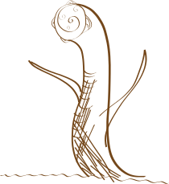

### Sun Bird

The <u>sun bird</u>,called is a mythological creature appearing and dying multiple times in history, from which can be safely assumed that there's multiple instances of it. Other assumptions take it as an aspect or servant of the Big Brother that cannot be destroyed, early siren mythology going as far as entitling it a messenger. In all instances it seems to have a modicum of control over all fire near it, and the ability to produce heat in a very short area around it's body.

"<u>╙╤╕</u>" in Moonlet singsong and pronounced as "<u>Scolou ndo</u>" by Dudas, the <u>Scolou</u> is the oldest known prominent instance. It's name translates very loosely to "Sundering", which reflects it's status as an agent of merciless renovation or, in some translations, destructive chaos. The two mythological cycles in which it's most prominent both relate the destruction of civilizations which have grown arrogant and complacent.

Shortly after it's death in Duda/Moonlet mythology[^SBDed], <u>"Nt nde ghe"</u> appears to griffons *"Carrying a message // In it's passage // And naught did it // But deem us misfit"*. This is immediately followed by a series of calamities that only ends after the griffonic hero *Gilgamesh* confronts and kills it. Like in the previous instance here it burns itself to ashes, possibly as a sort of ritualistic suicide to conserve it's honor.

Over two hundred years later, <u>اجرای</u> or <u>Ruith</u> terrifies the then city state of Alba[^Alba] -ruled by queen Scheherazade- with it's mere presence. The pony city was heavily influenced by griffons and traded with Dudas, who at the time were shifting into their modern sailing culture. By most accounts, the bird merely stood perched on a cart.

The queen *"Remained still, in front of a destroyer who was not destroying, and extended her great wings in a display of ladyness. Ruith in return extended it's wings arrogantly to a nearly equal but minor span, remaining still and defiant. Yet, under My Lady's gaze, it eventually folded them again. My Lady folded them in return shortly after, if only out of kindness."*

<u>Ruith</u> remained by her side for several decades as either a friend or a pet -It was a point of contention between the few narrators who wrote the history of this period- and during this time is described as joking and openly manipulative, finding mirth in tricking ponies who mistook it for mere animal and often ridiculing members of the court; all of this to Queen Scheherazade's unmasked amusement.

This lasts at least *"Ten tens of years, then half again as much"*, or a hundred and fifty years past two wars and five husbands. At this point the <u>sun bird</u> is -for the sole time in all tenable accounts- suffering from age; losing it's feathers and refusing to eat. As a last act, rather than dying of age, it again immolates itself to ashes.

The queen *"Spread his ashes to the sea with great gravity, her face an unreadable rictus, and jumped to the waters herself."* She was not found after this, and is presumed to have drowned.

Shortly after, the city spiraled to civil war due to the sudden, unexpected void in power and was eventually cannibalized by neighboring cities.

### Puclop

<u>Puclops</u>, known as <u>Pucas</u> to some and called <u>┕┈┉╝</u> in moonlet singsong, are small creatures said to reside in the stranded wood of houses or Duda ships -possibly pieces of the larger spirit of a household- that moonlets usually reserve respect for. Their disposition depends in large part on the house's inhabitants, and they are known to grow bitter the closer the wood is to sinking.

As they are respected creatures, moonlets usually consider it a moral duty to return the spirits and their wood to their own household, lest the <u>Puca</u> dies and weakens the household. They are also known to be mischievous if they lived with such a person, tricking anyone who approaches with either good natured jokes or outright malevolent intent.

According to the tale most spread among moonlets' <u>Pucas</u> are small, round creatures with three wooden horns made of splinters, each with a small, triangular eye under it and a mouth in the central point between the horns. Older ones usually grow feather-like green growths on their backs, which might or might not give them flight but are known to be integral to their magics: Malevolent <u>Pucas</u> can be weakened by plucking the feathers off their bodies, which doesn't seem to be particularly physically painful to them according to most reliable sources.

### Xolobdys
 

Common stories report <u>Xolobdys</u> as the offspring of a <u>taint child</u> and either <u>star spawn</u> or a <u>starcaster</u>, many of them by raping. Some others describe the <u>star spawn</u> as foolish enough to be tricked, and in an account it was a <u>starcaster</u> that fell in love with a taint beast. In another still <u>Xolobdys</u> is the offspring of the <u>queen-of-tides</u> and three <u>incubi</u>, again by tricking or raping her.

Regardless of origin, <u>Xolobdys</u> is a relevant creature on the lore of the sirens. According to them it's a creature with long, bony legs, no head, and a neck stump that devours insatiably, walking across the Styx silently. Reports are conflicting as to whether or not it's sapient, but it's been known to notice cities on the surface and swallow the water under them, creating a whirlpool that makes the inhabitants and even buildings fall down to it's maw.

The last reliable account comes from the siren queen Tajoom the third in one of her searches for the <u>queen-of-tides</u>. According to it, *'A great creature, ninety siren cubits tall and thirty across, lumbered across the old city [Of Totle] with legs wrapped in decaying flesh. Yet the wrasses didn't try to feed: They escaped with fear I had never seen in them. Some of my paladins wanted to attack the creature, but I considered it wiser to retreat.'*

### Pisces

<u>Pisces</u> is allegedly <u>star spawn</u> and a messenger of the <u>Big Brother</u> according to the joint moonlet-Duda mythology in which it's central. In their language, <u>Pisces</u>' name is best translated as <u>runs-on-the-air</u>, which might refer to flight or another, more esoteric concept.

The three most important stories concerning <u>Pisces</u> are all from the <u>┄┅═╕╷╼╱╮</u>, pronounced by Dudas as <u>Topo loi sene renne siene</u>, or <u>six days of rain, three of storm</u>[^numbers] cycle.

The first story is about how a thief -the <u>queen-of-tides</u> in modern iterations of the story, but just an unnamed one in the traditional ones- stole the <u>moon lady's</u> [^MoonLady] belly so that she might not eat. Because of this the moon fell ill from hunger, *'despite the sugar and oil her twinkles fed her'*, and over time too weak to control the tides properly. This led to the titular rain, caused by great waves hitting the dragons' fire mountains, which at the time were allegedly on the surface.

The second story tells of a moonlet called <u>╲╷╗</u> -translated to <u>Much-he-slides</u> and pronounced <u>Sunpo</u> by Dudas- and a Duda of the ydra line called <u>Riveros</u>. They are contacted by <u>Pisces</u>, to whom <u>Riveros'</u> crew owes an undetermined favor, and convinced to help the <u>moon lady</u> return to her health. For this, the friends travel to the other side of the world to talk with a <u>sun-bird</u>[^sun], who in this story is a messenger of the <u>sun lord</u>[^SunLord] and request his help. The story makes no mention of why didn't they just wait for day to come, which might mean the <u>sun-bird</u> was a requirement to contact the <u>sun lord</u> despite or even regardless of his position on the sky, or that the bird was in league with <u>Pisces'</u> interests.

<u>Pisces</u> appears many times during their travel, and near the ending christens them as it's paladins in reward for all their achievements with the admission that while it could've contacted the <u>sun-bird</u> on it's own, this was a chance for it to prove the worth of mortals to the <u>moon lady</u> and gain paladins.

The third story relates to <u>Pisces</u> more closely, and is about it's attempt and failure to reach the <u>moon lady</u> in time with the belly given by the <u>sun lord</u>, so that she might not die from hunger. However, when it's grieving, *'A great many tears spilled, singing a song sang by <u>Lyra</u>, whose wails reached the waters as a great storm.'* The crying lasts three days without their nights, during which '*The sky is black, stars red/And the moon nowhere, by death misled.*' and during this time the world falls into disarray: Siren queens can barely keep the tides from destroying everything in the surface with their crowns, the sun shines gray from sadness, and moonlets are unable to run on water.

<u>Riveros</u> -now a captain- and <u>Sunpo</u> however, are unable to accept this and '*With great vigor jumped the captain and crew \\ Again they jumped, and under 'em water blew \\ Yet again, ship shattering under the onslau' \\ One last time, and they are out of view \\ For on the hole-that's-not-moon they are now.*'.[^Jump] . Their jump is such that they reach the hole where the moon should be, entering the afterlife that all nightstars and twinkles seem to have followed the <u>moon lady</u> into. They whisper the stories of their feats into the belly given by the <u>sun lord</u>, and combined with <u>Pisces'</u> tears and Lyra's song *'The belly was now womb, and the womb devoured the moon lady. For nine days without their nights Lyra sang a beautiful song and the paladins told their tales, and <u>Pisces'</u> tears nourished the child within with the tales. The lady was thus rebirthed unto itself; now knowing the valor of mortals, and reinvigorated as a god.'*

While the last segment is harder to understand in the original telling of the story, it proposes a key trait of <u>Pisces</u> which is only implied in other stories, the many levels at which it's role as messenger work. Other parts reinforce this concept; Even after it's <u>Riveros</u> and <u>Sunpo</u> that earn the new belly, it's Pisces that transports it. And <u>Pisces</u>' intent in his initial deceit -saying that it couldn't be the one to ask for the belly- was from the beginning to convey a message to the <u>moon lady</u> which ultimately leads to her rebirth. This, interestingly enough, contrasts with a pervading contradiction in Duda culture-- Their antipathy to the idea that if you remain in your assigned station, everything will be fine.

Garey Larey -named after the monster of an old children's tale which might itself be related to this creature- is a creature that until recently assumed to be mere tale and thus shunned from written word. However, a spotting by our Lord Umberto's entourage has proven beyond any doubt that Garey is, as a mater of fact, a real creature.

It's body is similar to that of a snake or a slug, although it reflects light poorly, and is mostly noticeable because of two veins running at each of it's sides, both glowing with a blue shine that is described strikingly similar to that of a starcaster. It's face is usually described as rigid and glimmering, which has led some to assume it's a mask. 

Alegadly the Garey Larey is connected in some way to the nightstars, as either an aspect or messenger. In some stories, it's instead described as a starcaster who commited a depicable enough crime for her patron star to deliver such a punishment as removing it's ability to communicate or express any emotions. Other stories -these corroborated by what all the time was assumed to be drunken navigators- describe it to have control over water similar to telekinesis, prefaced by movement from the limbs that hang off the sides of it's neck. The stories all give a clear warning-- While the Garey rarely reacts to someone swiming to it, approaching it with a ship is ill advised.

### Cipazotl

The <u>Cipazotl</u> is a creature resembling vaguely a snake, with reddened and scaleless flesh which has been described as reddened as to seem infected. While it hasn't been sighted in recent times, it's appearance in several unrelated mythologies can be argued as a proof of it's existence. 

The earliest account is in the early siren culture, in which it's a recurring demon attempting to overthrow their dominion. Curiously enough, in this story it seems somewhat sympathetic to ponies- Although this could be reasoned, in light of later actions, as simple drive to topple the largest, most stable paragon of society at the time. It's last appearance in their history is when *"Six sirens of royal blood parlayed, and from their words sprung unity. With their unity were forged six crowns, with which the demon in red was banished."* The crowns are very probably the same crowns with which their empire lasted several centuries until they were supposedly stolen by the <u>queen-of-tides</u>, whose fate is uncertain.

At least a century passes after the sirens' fall before the <u>Cipazotl</u> appear in the midst of the *Duda-Moonlet Nascence War*, attacking the three fronts mercilessly. It was critically defeated after the eleventh such involvement in the battles, when Moonlets and Dudas staged preparation for a battle in order to lure it in. This is maybe the first case in which the <u>Cipazotl</u> is wounded gravely, being hit simultaneously by at least a twenty separate cannons operated by Dudas of the Rare design line and being forced to retreat in otder to heal. Notably, three moonlets were caught on the impact and two and swallowed some blood off the creature, both dying shortly after from acute poisoning.

After this, it appears occasionally in unreliable and unverifiable stories by sailors, meaning that it might have been active but cautious.

The next and last period in which it appears prominently is approximately six centuries ago, during the *Guevara war*. In this case the beast appeared as before- Striking both noble and uprising forces with equal cruelty. Griffons, the starters of the uprising, suffered the worst part of it when their stolen warship the *Amadeus* was sank by this creature. It proved to be a double edged sword, however, when the self-entitled captain of the ship caused all explosives in the ship to detonate, possibly killing the creature in the process.

------------
[^SBDed]: The exact nature is a contention point, as there are at least a dozen heroes to claim having done it. A common but unfunded interpretation of this is that there were at least a dozen <u>Scolous</u>.

[^Alba]: One of the first in recorded history.

[^numbers]: It's noteworthy that both three and six are important in early Moonlet-Duda cultures: By their mythological accounts their creators '*Made Dudas to think in threes so that they may have wit, and Moonlets in sixes so that they may be swift.*'

[^MoonLady]: The name moonlets and dudas give to the big brother.

[^sun]: It's unknown if this is somehow related to the already described sun-bird.

[^SunLord]: Known to us as <u>Big Sister</u>

[^Jump]: Some untranslatable word choices to describe the water seem to imply they are at the second corner of the world at this point.

