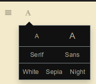

# Cirquesque's side material.

Side material for [Cirquesque](https://www.anonpone.com/cirquesque/)

Recommended themes: Sepia for _book about creatures_.  
Other than that, black for ease on the eyes.  

And no, I didn't add emojii to the headers. Gitbook's the one adding them.

Changelog:

16/10: Players have found [something](https://duendeinexistente.gitbooks.io/cirque/content/World.svg), and received the wooden diaries, which still aren't fully finished.

