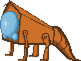

## Main party

#### Lettuce Leaf
(AKA Far Away Boy, Lyf, qt, boyo)

 

An Equestrian cook and farmer who may be too patient with people and who will try to talk the dragon out of keeping the princess captive, but is having to learn to apply violence the hard way. After a mysterious incident, he was transported to the sea.

He is outgoing, curious but cautious, and his personal issues worsen when he lets himself be too introspective. He is fluffy.

Lettuce Leaf is trying to find a way back to Equestria, and does not want any super-mystic fate-of-the-world crap.

#### Herb

An Equestrian forget-me-not bird searching the way back too, a little bard with little respect for personal space who's much more perceptive about people than may be apparent, and for whom life is just another tale. His entire culture revolves around storytelling and it shows; even as he searches his way back he is still compiling, cross referencing and making up stories in the library that is his head. He was sleeping on Leaf's roof when his house was transported.

Herb wants to collect stories and make his way back to his flock, and wishes the super-mystic fate-of-the-world crap would stay a small distance away so he can still see it unfold.

#### Seaweed

(AKA Francesca, Francis.)

 

An earth pony mare who has no sight and cares very little about it. This aloof huntress, whose lite and small figure, as well as her detached attitude, belie the danger she presents. She was first found floating lazily near a dragon. She is also an actress, although not forthcoming around the fact.

She is perceptive about people, but often doesn't know how to react to what she realizes other people feel, when she cares about them enough to want to help.

She has a snake.

Sea doesn't mind super-mystic fate-of-the-world so long as it keeps sending more and larger prey her way.

#### (the) Star

(AKA sufficiently-complex diplomacy-oriented intelligence beta zero point three bee, Purple_Unit)

This complex-enough inteligence, Purple_Unit, was sent along with five others by Twilight Sparkle to try assisting Leaf on his way back. She is chirpy, Politely professional or carefully oblivious when it serves her purposes, and she is most of all, not really intelligent because it's completely impossible that she is, and will argue this to the end of the world. Daemons in her head talk to her and ruined board games for her.

She is extremely prideful on the fact that she was built by no one else than Twilight Sparkle, yes the one that's a princess. And she will also learn how to communicate with snakes, just you wait.

She wishes she knew why is Natan so sad, or why is Nitzan so angry with her all the time.

She cannot for the life of her ever decide for a chess move.

Each of her pieces can act semi independently. Her role among the Stars is scouting and bridging of initial relationships, as well as protecting VIPs with her shield orb generator.

All this super-mystic fate-of-the-world stuff is fascinating to Star. She wants to find the other stars, collect *all of the data*, and help Lettuce Leaf find his way back to Equestria.

#### Natan and Nitzan

**Natan** is a Duda and once-to-be-captain in training, whose ship was sank and crew died when Star fell on them. Star is not aware of what she did, and he would prefer she remained that way. He doesn't want to blame her for falling on his ship. She had no way to avoid it and it'd be unfair of him.

He is protective, thoughtful to a fault, and eager to seek the invisible but intrinsic value in things and people. He sometimes wonders what is the nature of a hero. He misses his people, but is just ok with things because Nitzan needs him to be.

He cannot for the life of his ever decide for a chess move.

Natan wishes he knew what to do when the super-mystic fate-of-the-world stuff happens, and is tired of having to sit idle through it. He wants to reach Equestria for it's technology, in the hopes that it may help his species.

**Nitzan** is a younger Duda, the size of a hummingbird, who wishes she could just crawl somewhere dark and die. She blames Star for having killed everyone she once knew.

She wants to tell her mind to Star -who should in her opinion just go away forever- and is learning Equine with that sole purpose.

She looks up to Sea, and wishes she could be as unaffected and cool as she is.

Chess is a boring and absurdly easy game. Get her something more complex.

Nitzan is barely aware of any of the super-mystic fate-of-the-world stuff, because there's more important things in her life right now.